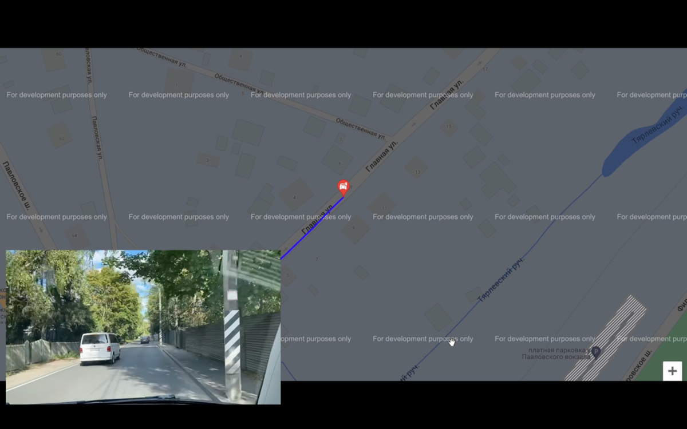

# Система геопозиционирования беспилотных автотранспортных средств (Демо)

NMEA 0183 (National Marine Electronics Association) — стандарт, определяющий текстовый протокол связи навигационного оборудования. NMEA протокол описывает большой список различных сообщений [1] [2]: 
- AAM – Прибытие в путевую точку
- ALM – Данные альманаха
- АPA – Данные автопилота «А»
- GLL – Данные широты и долготы
- GSA – Общая информация о спутниках
- GSV – Детальная информация о спутниках
- RMC – Рекомендованный минимальный набор GPS данных
- RTE – Маршрутная информация
- VTG – Вектор движения и скорости
- ZDA – Дата и время.
- И др.
  
В данной работе в качестве приемника GPS-сигнала выступает телефон модели “Apple iPhone 11” на операционной системе iOS 16.0. Для передачи сообщений было использовано приложение «GPS2IP Lite» базовой версии с возможностью передавать RMC сообщения. Формат сообщений RMC выглядит следующим образом:

$GPRMC,114150,A,5940.09689,N,03025.15153,E,25.58,165.5,120922,003.1,W*60;

где, 
- GPRMC – формат NMEA сообщения RMC;
- 114150 – время в формате UTC (11:45:50);
- A – статус приемника (A – active/активен);
- 5940.09689, N – координата широты (59° 40.09689`N);
- 03025.15153, E - координата долготы (30° 25.15153` E);
- 25.58 – скорость (в узлах);
- 165.5 – угол направления движения в градусах;
- 120922 – дата (12.09.2022);
- 003.1 – магнитное склонение;
- W – направление магнитного склонения;
- *60 - контрольная сумма 0x60.

Для приема и расшифровки сообщений с телефона использовался ноутбук «Apple MacBook Air M1» на операционной системе MacOS Monterey 12.4. Язык реализации программы: python. Для передачи данных использовалась локальная Wi-fi сеть. 

## Принцип работы разработанного ПО
Принцип работы разрабатываемой программы наглядно представлен на рисунке 1. 
 
 
 
Рисунок 1. Принцип работы разрабатываемого ПО

Телефон, выступающий в качестве GPS приемника, передает полученные данные в формате NMEA RMC по локальной сети на персональный компьютер. Далее, разработанная программа преобразует полученные данные в искомый формат и передает данные на веб-интерфейс (Рисунок 2). Передача данных на веб-интерфейс в динамическом формате выполняется с помощью фреймворка PubNub. 

  

Рисунок 2. Веб-интерфейс разрабатываемого ПО

PubNub это защищенная глобальная сеть потоковой передачи данных, которая позволяет разработчикам в реальном времени создавать, масштабировать и управлять функциональностью приложений и устройств в интернете вещей. Передача данных осуществляется через заранее открытые на сайте каналы связи. Управление состоянием каналов происходит через API.

## Анализ полученных данных 

Для измерения точности определения координат была выбрана определённая статичная точка на карте (точка геореференса). GPS приемник устанавливался на координаты соответствующей точки геореференса, после чего производились измерения координат. После проведения необходимых замеров рассчитывалось среднее квадратическое отклонение полученных данных от истинной точки координат.
  
Для более точной оценки погрешности было выполнено 4 измерения. На рисунке 3 представлено распределение координат в точке номер 1 и истинное отклонение координат от заданной точки на карте. Среднее квадратическое отклонение координаты широты составило 0,0000762°, среднее квадратическое отклонение координаты долготы составило 0,0000497°. Погрешность составила 7 м.

  
  
Рисунок 3. Отклонение координат от точки №1

На рисунке 4 представлено распределение координат в точке номер 2 и истинное отклонение координат от заданной точки на карте. Среднее квадратическое отклонение координаты широты составило 0,0000685°, среднее квадратическое отклонение координаты долготы составило 0,0000259°. Погрешность составила 7 м.

  

Рисунок 4. Отклонение координат от точки №2

На рисунке 5 представлено распределение координат в точке номер 3 и истинное отклонение координат от заданной точки на карте. Среднее квадратическое отклонение координаты широты составило 0,0000434°, среднее квадратическое отклонение координаты долготы составило 0,0000101°. Погрешность составила 3,5 м.

  

Рисунок 5. Отклонение координат от точки №3

На рисунке 6 представлено распределение координат в точке номер 4 и истинное отклонение координат от заданной точки на карте. Среднее квадратическое отклонение координаты широты составило 0,0000185°, среднее квадратическое отклонение координаты долготы составило 0,0000278°. Погрешность составила 2,5 м.

  

Рисунок 6. Отклонение координат от точки №4

На рисунке 7 представлено итоговое распределение координат в точках номер 1 (красная), 2 (зеленая), 3 (оранжевая), 4 (фиолетовая) и истинное отклонение координат от заданных точек на карте. Итоговая погрешность измерений составила примерно 5 м.  

  

Рисунок 7. Итоговое отклонение координат от заданных точек

Дополнительно, в приложении к отчету, представлен видеофайл с результатом измерений.
# Экстраполяция траектории движения БП ТС на основе данных ГНСС

Первым этапом были собраны координаты движения автомобиля по асфальтированной поверхности по адресу ****. Всего было собрано 440 координат.
Вторым этапом полученные координаты были обработаны с помощью ПО, представленного ранее. Обработанные данные сохранены в excel файл. 
Третьим этапом с помощью встроенного инструмента Excel была выбрана функция для дальнейшего экстраполирования. По результатам анализа наиболее приемлемой оказалась функция полином второй степени (Рисунок 8). 

  
Рисунок 8. Экстраполяция траектории движения посредством Excel

Четвертым этапом с помощью встроенной функции построения полиномов в библиотеку numpy, был проведен более детальный анализ экстраполяции траектории движения автомобиля. По результатам анализа наиболее приемлемым оказалась функция полином шестой степени (Рисунок 9).

  

Рисунок 9. Экстраполяция траектории движения

	Итоговые коэффициенты функции представлены на рисунке 10.

  

Рисунок 10. Коэффициенты функции экстраполяции

Для оценки качества предсказаний использовалась «средняя абсолютная ошибка – MAE». По результатам расчетов MAE полинома шестой степени: 0.**0002345106227979146**, MAE полинома второй степени: 0.**00038715245627833167**. Что позволяет сделать вывод, что предсказания выполненные с помощью функции полином шестой степени более точные.

Заключительным этапом предсказанные координаты были нанесены на Google карту местности.  Результаты представлены на рисунке 11. 

  

Рисунок 11. Результат экстраполяции траектории движения на карте местности

На левом изображении рисунка 4 представлен результат экстраполяции по функции полином шестой степени на карту местности на всем ранее записанном объеме координат (синим цветом – конец маршрута, зеленым – предсказанный маршрут).  Стоит заметить, что далее по маршруту действительно должен следовать поворот. 

На центральном и на правом изображениях рисунка 4 представлен результат экстраполяции от половины имеющихся координат. Как итог, предсказание маршрута на десять ближайших точек выполнен верно. Особенно это заметно на правом, приближенном, изображении.

## Вывод данных местоположения беспилотного транспортного средства на интерфейс веб-сервиса

Вторая часть  подразумевала создание веб-интерфейса, способного в реальном времени принимать координаты движения транспортного средства с ГНСС устройства и строить траекторию движения (маршрут) на карте.
Для реализация данной функции был использован алгоритм представленный ранее в главе 1 (рисунок 1). Передача данных на веб-интерфейс в динамическом формате выполняется с помощью фреймворка pubnub. Результат работы программы представлен на рисунке 12.

  

Рисунок 12. Результат работы

## Реализация протокола передачи данных 

Целью данной главы является создание протокола обмена данными между беспилотным транспортным средством и объектом инфокоммуникационной инфраструктуры.  Для наглядности, на ранее разработанный интерфейс добавлено два транспортных средства, а также точка, определяющая объект транспортной инфраструктуры (Рисунок 13). 

  

Рисунок 13. Отслеживание местоположения двух условно беспилотных транспортных средств

Вторым этапом создается формат запроса получения данных и прописываются основные данные, передаваемые от автомобиля клиенту (объект транспортной инфраструктуры). 
По запросу “/get info *** “, вместо звездочек вписывается идентификатор транспортного средства, от транспортного средства передается информация типа: 

/get info ***

{"Номер пакета: int
	Дата (Время) отправки: str
	Идентификатор ТС: str
	Данные о местоположении: str
	Скорость: float
	Статус ТС: str"}
 
В строке «Номер пакета» указывается порядковый номер отправленного пакет. В строке «Дата (Время) отправки» указывается дата и время отправки сообщения. В строке «Идентификатор ТС» указывается идентификатор транспортного средства. В строке «Данные о местоположении» указываются координаты транспортного средства в текущий момент времени. В строке «Скорость» указывается скорость транспортного средства в км/ч. В строке «Статус ТС» указывается состояние транспортного средства (Движется, стоит).
